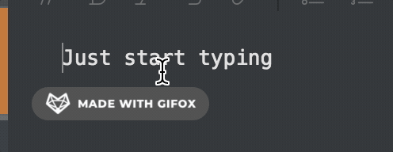

# Usage
Just simple plugin that provides autocompletion for emojis. To try it out just invoke the autocompleter drop-down with a `:` followed by some letters indicating the emoji you'd like to insert.
 

## Limitations
Emojisense currently only works inside the main editor, future versions will support title and tags. This plug-in also only currently supports unicode emojis, future versions will support other flavors as well.

## Roadmap

Aside from the aforementioned limitations, I am currently working on tag-specific features that will automatically assign an emoji based on the tag. Also, I will make these features customizable through the UI.

# Credits 

This plug-in was heavily inspired by [Matt Bierner's VSCode plug-in :emojisense:](https://marketplace.visualstudio.com/items?itemName=bierner.emojisense).

>*  Icon from emojione: https://www.emojione.com
> 
>*  Atom autocomplete+ emojis suggestions plugin

Thanks @craftzdog for being patient with me despite my Inkdrop n00bishness!